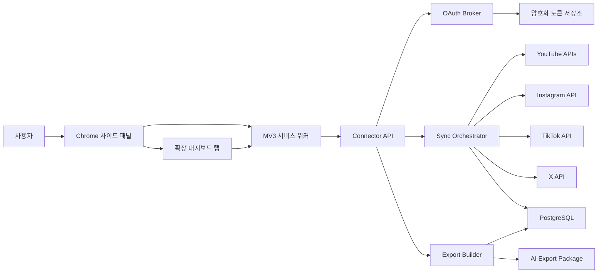
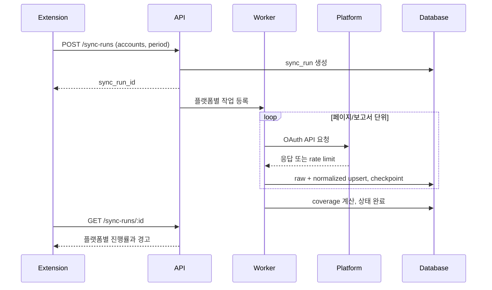

# 기술 아키텍처

## 1. 핵심 결정

Chrome 확장프로그램만으로 모든 OAuth와 장기 토큰 보관을 처리하지 않는다. 확장 패키지는 누구나 내려받아 내부 값을 볼 수 있으므로 client secret을 안전하게 숨길 수 없다. 운영 구조는 **Manifest V3 확장프로그램 + OAuth/수집 백엔드 + 데이터 저장소**다.

확장프로그램은 페이지 스크래핑용 content script를 사용하지 않는다. 필요한 Chrome 권한은 `identity`, `storage`, `sidePanel`, `downloads`와 우리 API 도메인의 host permission으로 제한한다.

## 2. 시스템 구성



## 3. 권장 기술 스택

빈 저장소에서 시작하므로 전체를 TypeScript 모노레포로 통일한다.

| 영역 | 선택 | 이유 |
| --- | --- | --- |
| 패키지 관리 | pnpm workspaces | 앱과 공통 패키지의 빠른 로컬 연결 |
| 확장 UI | React + Vite + CRXJS | MV3 개발·빌드와 HMR 구성 단순화 |
| 상태/요청 | TanStack Query + 경량 로컬 상태 | 서버 상태, 재시도, 진행 상태에 적합 |
| API | Fastify + TypeScript | 명시적인 플러그인 경계와 검증, 낮은 오버헤드 |
| 스키마 | Zod | API, adapter, export 계약을 한 타입 계층으로 검증 |
| 데이터 | PostgreSQL + Drizzle | 시계열 스냅샷과 JSON 원본을 함께 다루기 쉬움 |
| 작업 큐 | MVP는 DB 작업 테이블, 이후 BullMQ | 초기 운영 복잡도를 줄이고 필요 시 분리 |
| 테스트 | Vitest + Playwright | 단위·계약 테스트와 실제 확장 UI 흐름 검증 |

예상 디렉터리 구조:

```text
apps/
  extension/
  api/
  worker/
packages/
  contracts/
  connector-core/
  connector-youtube/
  connector-instagram/
  connector-tiktok/
  connector-x/
  export-builder/
docs/
```

반복 가능한 커넥터 작업은 추후 `skills/social-connector/SKILL.md`, `scripts/scaffold-connector.ts`, `references/metric-registry.md`, `assets/fixtures/` 형태로 분리할 후보로 둔다. 이는 작업 지침, 결정적 스크립트, 참조 자료를 분리하는 Agent Skills 패턴을 따른다.

## 4. 확장프로그램 설계

### 서비스 워커

- 백엔드 세션 생성과 API 요청 조정
- 동기화 진행 알림과 badge 상태
- OAuth 창 시작 및 redirect 결과 전달
- 다운로드 시작
- 장기 실행을 서비스 워커 생명주기에 의존하지 않음

MV3 서비스 워커는 필요할 때 시작되고 중단될 수 있다. 실제 수집 작업은 백엔드 작업으로 만들고, 확장프로그램은 `sync_run_id`를 폴링하거나 이벤트 스트림으로 상태를 갱신한다.

### 저장소 사용

- `chrome.storage.local`: UI 설정, 마지막 선택 기간, 연결 상태 캐시
- IndexedDB: 화면용 제한적 캐시와 오프라인 내보내기 임시 데이터
- 백엔드: 정규화 데이터, 동기화 이력, 암호화 토큰, 원본 응답
- 금지: client secret, refresh token, 전체 원본 응답을 `chrome.storage`에 영구 저장

### 권한 원칙

- `tabs`, `cookies`, 광범위한 `<all_urls>`는 MVP에서 요청하지 않는다.
- OAuth는 사용자 버튼 클릭 후에만 대화형 창을 연다.
- host permission은 우리 API와 필요한 OAuth redirect 범위로 한정한다.
- CSP를 엄격하게 유지하고 원격 코드를 실행하지 않는다.

## 5. 백엔드 경계

### OAuth Broker

- 플랫폼별 authorization URL 생성
- `state`, PKCE verifier, nonce 검증
- authorization code 교환과 token refresh
- scope 및 만료 시각 기록
- 연결 해제 시 provider revoke와 로컬 삭제

### Connector

각 connector는 같은 인터페이스를 구현한다.

```ts
interface PlatformConnector {
  getAccount(context: SyncContext): Promise<RawAccount>;
  listContent(context: SyncContext, cursor?: string): Promise<RawPage>;
  getAccountMetrics(context: SyncContext): Promise<RawMetricSet>;
  getContentMetrics(context: SyncContext, ids: string[]): Promise<RawMetricSet>;
  normalize(input: RawSyncPayload): NormalizedSyncPayload;
}
```

공통 오케스트레이터는 pagination, retry, rate limit, checkpoint를 담당하고 connector는 플랫폼 의미와 API 호출만 담당한다.

### Export Builder

- 선택 기간에 맞는 스냅샷 조회
- coverage 및 warning 계산
- 공통 지표 요약과 플랫폼 고유 섹션 생성
- Markdown, JSON, CSV 생성
- 토큰, 이메일, 내부 오류 세부정보 제거

## 6. 핵심 데이터 엔터티

| 엔터티 | 역할 |
| --- | --- |
| `user` | 제품 사용자 |
| `connection` | 플랫폼, scope, 상태, 토큰 참조 |
| `account` | 플랫폼 채널/프로필 식별자와 현재 메타데이터 |
| `content_item` | 영상, Reel, Post 등 원본 콘텐츠 |
| `sync_run` | 기간, 상태, 커서, 오류, API 버전 |
| `metric_observation` | 계정 단위 시점/기간 지표 |
| `content_metric_observation` | 콘텐츠 단위 지표 |
| `raw_payload` | 압축된 원본 응답과 만료 정책 |
| `export_bundle` | 생성 조건, 파일, checksum |
| `coverage_warning` | 미지원, 임계치, 지연, 부분 실패 |

모든 지표 행에는 최소한 다음 provenance를 둔다.

```json
{
  "metricId": "views",
  "value": 1234,
  "unit": "count",
  "scope": "account_period",
  "periodStart": "2026-06-13",
  "periodEnd": "2026-07-10",
  "source": "youtube_analytics_api",
  "method": "provider_reported",
  "collectedAt": "2026-07-11T03:00:00Z",
  "coverage": "complete"
}
```

## 7. 동기화 흐름



## 8. 보안과 개인정보

- 토큰은 envelope encryption을 사용해 서버에서 암호화한다.
- 로그에는 authorization code, access token, refresh token, 전체 응답 본문을 남기지 않는다.
- 권한은 연결 시 설명하고 수익 같은 민감 범위는 점진적으로 추가한다.
- 모든 export에 개인정보 포함 여부와 생성 시각을 명시한다.
- 사용자는 연결 해제, 데이터 삭제, export 삭제를 직접 실행할 수 있다.
- 계정별 데이터 보존 기간을 설정하고 원본 payload는 정규화 데이터보다 짧게 보존한다.
- OAuth 앱 심사와 Chrome Web Store 개인정보 공개에 필요한 데이터 흐름표를 유지한다.

## 9. 운영 관측성

- 플랫폼, endpoint, status code, latency, retry count를 토큰 없이 기록한다.
- rate limit 잔량과 비용 추정치를 플랫폼별로 표시한다.
- connector별 성공률과 마지막 정상 fixture 버전을 추적한다.
- API schema 변경을 계약 테스트 실패로 조기에 발견한다.
