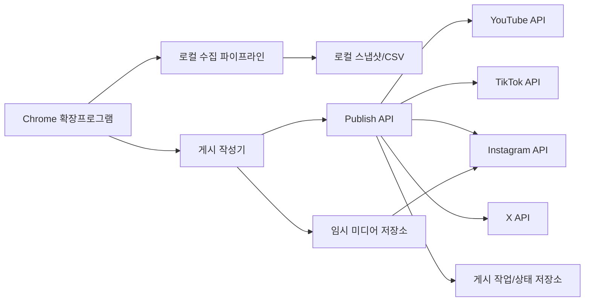

# 교차 플랫폼 자동 업로드 설계

- 상태: 구현 승인 전 설계안
- 기준일: 2026-07-12
- 대상 플랫폼: YouTube, TikTok, Instagram, X
- 제품 원칙: 사용자가 최종 내용을 확인한 뒤 한 번의 명시적 동작으로 게시

## 1. 결론

자동 업로드는 구현 가능하다. 안정적인 제품으로 만들려면 플랫폼 업로드 화면을 자동 클릭하지 않고 공식 게시 API를 사용한다.

MVP 사용자 흐름은 다음과 같다.

1. 확장프로그램에서 영상 파일을 한 번 선택한다.
2. 공통 문구를 입력하고 플랫폼별 문구·공개 범위·옵션을 조정한다.
3. 파일 규격과 계정 연결 상태를 사전 검증한다.
4. 최종 검토 화면에서 대상 계정과 전송 정보를 확인한다.
5. 사용자가 `선택한 채널에 게시`를 누른다.
6. 업로드, 처리, 게시 상태를 플랫폼별로 추적한다.
7. 성공한 게시물 URL을 저장하고 실패한 플랫폼만 재시도한다.

사용자 확인 없이 예약 시각에 자동 게시하는 기능은 API 심사와 수동 게시 안정성이 확인된 뒤 추가한다.

## 2. 플랫폼별 실현 가능성

| 플랫폼 | 공식 경로 | MVP 가능 여부 | 주요 조건 |
| --- | --- | --- | --- |
| YouTube | Data API `videos.insert` | 가능 | `youtube.upload` OAuth, resumable upload, 미검증 프로젝트는 비공개 제한 |
| TikTok | Content Posting API Direct Post | 가능 | `video.publish`, Creator Info 표시, 명시적 동의, 앱 audit 전 비공개 제한 |
| Instagram | Instagram API Content Publishing | 조건부 가능 | Professional 계정, content publish 권한, 외부에서 접근 가능한 `video_url`, 앱 심사 |
| X | Media Upload + `POST /2/tweets` | 가능 | 사용자 OAuth, API access tier, 비디오 비동기 처리와 사용량 제한 |

공식 게시 권한을 아직 받지 못한 플랫폼은 `보조 게시` 모드로 전환한다. 보조 게시 모드는 업로드 페이지를 열고 캡션을 클립보드에 준비하며, 실제 파일 선택과 게시 확정은 사용자가 수행한다.

## 3. 제품 범위

### MVP

- 영상 파일 한 번 선택
- YouTube, TikTok, Instagram, X 대상 선택
- 플랫폼별 계정과 권한 상태 표시
- 공통 캡션과 플랫폼별 override
- 공개 범위와 댓글 허용 등 필수 옵션
- 사전 규격 검증
- 최종 확인 후 즉시 게시
- 업로드 진행률과 처리 상태
- 부분 성공과 플랫폼별 재시도
- 게시 URL과 원본 파일 hash 기록
- 중복 게시 방지

### 후속

- 예약 게시
- 반복 게시 템플릿
- AI 캡션·해시태그 초안
- 플랫폼별 썸네일과 첫 프레임 선택
- 게시 후 1/6/24/72시간 자동 수집 연결
- 팀 승인과 게시 캘린더

### 비목표

- 플랫폼 웹 UI의 게시 버튼 무인 클릭
- CAPTCHA 또는 추가 인증 우회
- 사용자 검토 없는 대량 게시
- 플랫폼 정책을 우회하는 공개 범위 설정
- 업로드한 원본 영상의 무기한 서버 보존

## 4. 수집과 게시의 경계



- 수집: 로그인된 탭의 DOM을 읽으며 기본적으로 로컬에서 완료한다.
- 게시: OAuth 쓰기 권한과 플랫폼 API를 사용하며 백엔드가 필요하다.
- 임시 미디어: 한 번 업로드한 파일을 플랫폼별로 전송하고 Instagram이 가져갈 수 있게 짧은 시간 제공한다.
- 장기 보존: 게시 성공 또는 24시간 후 원본 미디어를 자동 삭제한다.

## 5. 왜 백엔드가 필요한가

- OAuth client secret과 refresh token을 확장 번들에 넣을 수 없다.
- 브라우저 서비스 워커는 큰 파일 업로드와 장기 처리 상태 추적에 적합하지 않다.
- Instagram은 서버가 접근 가능한 영상 URL을 사용해 미디어 컨테이너를 만든다.
- YouTube와 X의 큰 영상은 중단 가능한 resumable/chunked upload가 필요하다.
- TikTok과 Instagram의 처리 완료를 webhook 또는 polling으로 추적해야 한다.
- 게시 작업의 idempotency와 재시도를 브라우저 재시작과 독립적으로 유지해야 한다.

권장 추가 인프라는 PostgreSQL과 S3 호환 object storage다. 초기에는 Cloudflare R2, AWS S3, MinIO 중 하나를 선택할 수 있다.

## 6. 파일 전송 흐름

1. 확장프로그램이 파일명, 크기, MIME, SHA-256, 길이와 해상도를 계산한다.
2. 백엔드에서 upload session과 multipart signed URL을 발급한다.
3. 확장프로그램이 파일을 object storage로 직접 분할 업로드한다.
4. 백엔드는 hash와 크기를 검증하고 `media_asset`을 준비 상태로 바꾼다.
5. 게시 어댑터가 같은 asset을 플랫폼별 요구에 맞게 전송한다.
6. Instagram에는 만료 시간이 충분한 서명 URL 또는 전용 pull URL을 제공한다.
7. 모든 플랫폼이 파일을 인수하면 보존 만료 시각을 단축한다.

동일 SHA-256 파일이 준비 상태로 존재하면 다시 업로드하지 않고 재사용하되, 사용자가 다른 영상으로 착각하지 않도록 파일명과 미리보기를 다시 확인한다.

## 7. 게시 작업 모델

```ts
interface PublishJob {
  id: string;
  mediaAssetId: string;
  state:
    | "draft"
    | "uploading_asset"
    | "ready_for_review"
    | "publishing"
    | "partially_completed"
    | "completed"
    | "failed"
    | "cancelled";
  targets: PublishTarget[];
  createdAt: string;
  confirmedAt: string | null;
}

interface PublishTarget {
  platform: "youtube" | "instagram" | "tiktok" | "x";
  accountId: string;
  state:
    | "pending"
    | "uploading"
    | "processing"
    | "published"
    | "failed"
    | "cancelled";
  caption: string;
  options: Record<string, unknown>;
  providerPublishId: string | null;
  publishedContentId: string | null;
  publishedUrl: string | null;
  errorCode: string | null;
}
```

`media_asset`, `publish_job`, `publish_target`, `publish_event`를 별도 엔터티로 둔다. 플랫폼 응답의 토큰과 upload URL은 로그에 남기지 않는다.

## 8. 게시 어댑터 계약

```ts
interface PublisherAdapter<TOptions> {
  readonly platform: "youtube" | "instagram" | "tiktok" | "x";
  getAccount(context: PublishContext): Promise<PublishAccount>;
  getCapabilities(context: PublishContext): Promise<PublishCapabilities>;
  validate(input: PublishInput<TOptions>): Promise<ValidationResult>;
  start(input: PublishInput<TOptions>): Promise<PublishReceipt>;
  getStatus(receipt: PublishReceipt): Promise<PublishStatus>;
  cancel?(receipt: PublishReceipt): Promise<CancelResult>;
}
```

어댑터는 플랫폼별 업로드 방식만 담당한다. 공통 오케스트레이터가 사용자 확인, idempotency, retry, 상태 이벤트, 임시 파일 삭제를 담당한다.

## 9. 플랫폼별 구현

### 9.1 YouTube

- 기존 Google OAuth 연결에 `youtube.upload`를 점진적으로 추가한다.
- `videos.insert` resumable upload로 파일과 제목, 설명, 태그, 카테고리, 공개 범위를 보낸다.
- 아동용 여부와 합성 미디어 공개 같은 필수 정책 필드를 검토 화면에 표시한다.
- 미검증 API 프로젝트에서는 업로드가 비공개로 제한될 수 있으므로 개발 단계 기본값도 `private`로 둔다.
- 처리 상태가 완료된 뒤 최종 영상 URL을 저장한다.

### 9.2 TikTok

- Content Posting API와 `video.publish` scope를 사용한다.
- 게시 전 Creator Info를 조회해 계정이 허용하는 공개 범위와 최대 길이를 UI에 반영한다.
- duet, stitch, comment 옵션은 API가 반환한 계정 조건을 벗어나지 못하게 한다.
- 사용자가 최종 게시 버튼을 누른 시각을 consent evidence로 기록한다.
- FILE_UPLOAD로 초기화하고 TikTok upload URL에 분할 전송한다.
- publish status endpoint 또는 webhook으로 완료를 확인한다.
- unaudited client는 공개 게시가 제한되므로 audit 전에는 테스트/비공개 모드로 표시한다.

### 9.3 Instagram

- Professional 계정만 활성화하고 개인 계정에는 전환 안내를 표시한다.
- Instagram content publish 권한을 별도로 요청한다.
- object storage의 임시 `video_url`로 `REELS` media container를 생성한다.
- 컨테이너가 `FINISHED`가 될 때까지 상태를 확인한 뒤 `media_publish`를 호출한다.
- 캡션과 `share_to_feed`를 플랫폼별 옵션으로 제공한다.
- 영상 URL은 Meta가 가져갈 수 있을 만큼 유지하고 처리 완료 후 폐기한다.

### 9.4 X

- 사용자 컨텍스트 OAuth와 게시 쓰기 권한을 사용한다.
- 비디오는 chunked media upload의 INIT → APPEND → FINALIZE 흐름으로 전송한다.
- 비동기 처리 상태가 성공한 뒤 media ID를 `POST /2/tweets`에 연결한다.
- 계정과 API access tier가 허용하는 파일 크기·길이를 사전 검증한다.
- 게시물 본문 제한과 중복 문구 경고를 표시한다.

## 10. 플랫폼별 작성 필드

| 필드 | YouTube | TikTok | Instagram | X |
| --- | --- | --- | --- | --- |
| 제목 | 필수 | 캡션에 통합 | 캡션에 통합 | 본문에 통합 |
| 설명/캡션 | 지원 | 지원 | 지원 | 지원 |
| 공개 범위 | 공개/일부공개/비공개 | Creator Info 허용값 | 계정/API 정책 | 게시 계정 정책 |
| 댓글 허용 | 정책 필드 | 지원 | 계정 설정 중심 | 답글 설정 후속 |
| Duet/Stitch | 없음 | 지원 | 없음 | 없음 |
| 피드 동시 공유 | Shorts 정책 | 없음 | `share_to_feed` | 없음 |
| 예약 게시 | 후속 | 후속 | 후속 | 후속 |

공통 캡션을 그대로 복제하지 않고 플랫폼별 길이와 문법을 검사한다. 사용자가 각 카드에서 override하지 않았을 때만 공통 캡션 변경을 전파한다.

## 11. 사용자 확인과 안전

게시 시작 직전 다음 항목을 한 화면에 보여준다.

- 영상 미리보기, 파일명, 길이, 해상도, 크기
- 플랫폼과 실제 대상 계정
- 플랫폼별 최종 문구
- 공개 범위
- 댓글, duet, stitch, feed 공유 옵션
- 업로드가 외부 플랫폼으로 전송된다는 설명
- 심사 전 비공개 제한 또는 API 제약

`선택한 채널에 게시`는 외부 쓰기 동작이므로 항상 명시적 사용자 클릭으로 시작한다. 설정 화면의 단순 저장이나 파일 선택이 게시를 시작해서는 안 된다.

## 12. 중복과 재시도

- `account_id + platform + media_sha256 + caption_hash`를 idempotency 기준으로 사용한다.
- 24시간 안에 같은 조합이 성공했으면 다시 게시하기 전에 경고한다.
- 네트워크 오류는 동일 provider upload session으로 재개한다.
- 검증 오류와 권한 오류는 자동 재시도하지 않는다.
- 한 플랫폼 실패가 다른 플랫폼의 게시를 취소하지 않는다.
- 이미 게시된 target은 전체 재시도에서 건너뛴다.
- 게시 취소는 플랫폼이 지원하고 아직 취소 가능한 단계에서만 제공한다.

## 13. UI 구조

### 게시 작성기

- 파일 선택/드롭 영역
- 영상 미리보기와 규격 검사
- 플랫폼 선택 체크박스
- 공통 캡션
- 플랫폼별 옵션 탭
- `검토하기` 버튼

### 최종 검토

- 플랫폼별 대상 계정 카드
- 경고와 공개 범위
- 예상 전송 파일과 메타데이터
- `선택한 채널에 게시` 버튼

### 게시 진행

- 자산 업로드 진행률
- 플랫폼별 `대기 → 업로드 → 처리 → 게시됨`
- 실패 사유와 해당 플랫폼 재시도
- 게시 URL 열기

## 14. 권한과 보안

- 읽기 OAuth와 쓰기 OAuth scope를 분리하고 게시 기능을 켤 때만 쓰기 scope를 요청한다.
- refresh token은 기존 AES-256-GCM token vault에 암호화한다.
- 임시 미디어 URL은 추측 불가능하고 짧게 만료되며 목록 조회를 허용하지 않는다.
- object storage는 서버 측 암호화와 자동 lifecycle 삭제를 사용한다.
- 파일 원본, access token, provider upload URL을 애플리케이션 로그에 기록하지 않는다.
- 사용자는 게시 연결 해제와 임시 파일 즉시 삭제를 실행할 수 있다.

## 15. 구현 순서

| 단계 | 범위 | 완료 기준 |
| --- | --- | --- |
| 1 | 공통 게시 계약과 작성기 UI | 파일 선택부터 최종 검토까지 로컬 동작 |
| 2 | object storage와 multipart upload | 대용량 파일 재개와 24시간 자동 삭제 |
| 3 | YouTube publisher | 비공개 테스트 업로드와 상태 확인 |
| 4 | TikTok publisher | unaudited 비공개 Direct Post 성공 |
| 5 | Instagram publisher | Professional 테스트 계정 Reel 게시 |
| 6 | X publisher | 비디오 업로드와 Post 생성 |
| 7 | 부분 성공, 재시도, 게시 기록 | 같은 파일 중복 게시 방지 |
| 8 | 앱 심사와 공개 게시 | 플랫폼별 audit/review 통과 |

수집 MVP를 먼저 완성한 뒤 게시 작성기와 YouTube 비공개 업로드를 수직 슬라이스로 구현한다. 이후 TikTok, Instagram, X를 붙인다.

## 16. 완료 기준

- 사용자가 같은 영상 파일을 플랫폼마다 다시 선택하지 않는다.
- 게시 시작 전 대상 계정, 문구, 공개 범위를 확인한다.
- 최소 한 플랫폼 실패 시 성공 플랫폼의 결과와 URL이 보존된다.
- 브라우저를 닫아도 백엔드 게시 작업과 처리 상태 확인이 계속된다.
- 같은 파일과 메타데이터를 실수로 중복 게시하지 않는다.
- 게시 완료 후 원본 미디어가 보존 정책에 따라 자동 삭제된다.
- API 심사 전 제한을 공개 게시 성공으로 오인하지 않는다.
- 화면 자동 클릭 없이 공식 API로 최종 게시한다.

## 17. 공식 참고

- YouTube `videos.insert`: https://developers.google.com/youtube/v3/docs/videos/insert
- TikTok Content Posting API: https://developers.tiktok.com/doc/content-posting-api-get-started/
- TikTok Direct Post: https://developers.tiktok.com/doc/content-posting-api-reference-direct-post
- Instagram API Reels Publishing: https://www.postman.com/meta/instagram/folder/23987686-8cdc2637-eebc-4770-aa59-7b0a0bba5a64
- X Media API: https://docs.x.com/x-api/media/introduction
- X Manage Posts: https://docs.x.com/x-api/posts/manage-tweets/introduction
