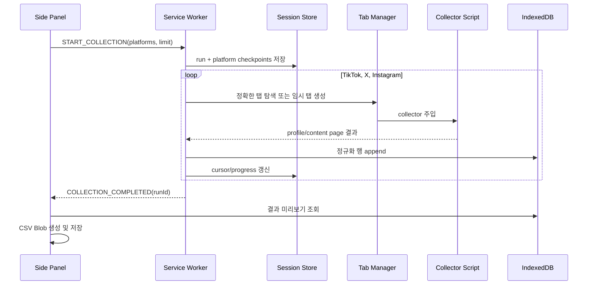

# CSV 추출 확장프로그램 MVP 실행 계획

- 상태: 구현 착수 기준안
- 기준일: 2026-07-12
- 목표 버전: `0.2.0-alpha`
- 대상 사용자: loorbit 계정을 사용하는 단일 Chrome 프로필

## 1. 범위 잠금

첫 MVP의 유일한 핵심 작업은 다음 문장으로 정의한다.

> 로그인된 Chrome에서 `전체 채널 수집`을 누르면 TikTok, Instagram, X의 프로필과 콘텐츠 지표를 수집하고, 누락 상태가 명확한 CSV를 저장한다.

### 반드시 포함

- TikTok Studio 콘텐츠와 프로필 수집
- Instagram 프로필과 Reel 좋아요·댓글 수집
- X 프로필과 영상 게시물 지표 수집
- 플랫폼당 최신 100개 또는 10분 안전 한도
- 기존 정확한 탭 재사용 또는 비활성 임시 탭 생성
- 사용자 탭 보존과 확장 소유 탭 정리
- 플랫폼별 부분 실패와 재시도
- 실행 결과 미리보기
- UTF-8 BOM CSV 저장
- 최근 수집 실행 로컬 보존과 전체 삭제
- `0`과 미제공·로딩 실패 구분

### 조건부 포함

- YouTube API가 이미 연결돼 있으면 현재 snapshot을 같은 CSV에 병합한다.
- YouTube가 미설정이거나 API가 오프라인이어도 세 브라우저 플랫폼의 CSV 생성을 막지 않는다.

### 제외

- 자동 업로드와 게시 작성기
- 예약 수집
- AI 직접 전송
- 댓글 본문, DM, 팔로워 목록
- Instagram 조회수 추정
- 동일 원본 영상 자동 묶기
- 플랫폼당 100개를 넘는 전체 이력 이어받기
- 클라우드 동기화와 다중 사용자

자동 업로드는 [교차 플랫폼 자동 업로드 설계](AUTOMATED_PUBLISHING_SPEC.md)에 보존하되 CSV MVP가 완료될 때까지 구현하지 않는다.

## 2. MVP 완료 정의

다음 시나리오가 한 번에 통과하면 CSV MVP가 완료된 것으로 본다.

1. 사용자가 loorbit Chrome 프로필에서 확장 아이콘을 누른다.
2. 사이드 패널에 TikTok, Instagram, X의 권한과 로그인 상태가 표시된다.
3. 사용자가 `전체 채널 수집`을 누른다.
4. 필요한 임시 탭이 비활성으로 열리고 플랫폼이 순차 수집된다.
5. 결과 화면에 플랫폼별 계정 1행과 현재 콘텐츠 행이 표시된다.
6. Instagram 조회수는 빈 값, 댓글은 실제 0으로 구분된다.
7. `CSV 저장`으로 Excel 호환 파일을 내려받는다.
8. PowerShell `Import-Csv`로 같은 행 수와 열 수를 읽는다.
9. 확장프로그램이 만든 탭만 닫히고 기존 사용자 탭은 그대로 남는다.
10. 한 플랫폼을 강제로 실패시켜도 나머지 결과를 CSV로 저장할 수 있다.

실계정 기준값은 테스트 당시에 변할 수 있으므로 숫자 자체보다 콘텐츠 ID, source surface, 수집 시각과 화면의 최신 표시값 일치를 검사한다.

## 3. 사용자 흐름

### 3.1 최초 실행

```text
Creator Data Bridge

채널 수집
TikTok      권한 필요   [허용]
Instagram   권한 필요   [허용]
X           권한 필요   [허용]

                  [전체 채널 수집]
```

- `허용`은 해당 플랫폼의 선택적 host permission만 요청한다.
- 권한 허용 후 로그인 상태를 읽는다.
- 로그인이 필요하면 `로그인 열기` 버튼으로 해당 사이트를 열고 사용자가 로그인한다.
- 비밀번호나 인증 코드를 확장프로그램 UI에서 받지 않는다.

### 3.2 수집 준비

```text
TikTok      @loorbit0       준비됨
Instagram   @loorbit0       준비됨
X           @Loorbit0       준비됨
YouTube     API 미설정      제외됨

범위        최신 100개
                  [전체 채널 수집]
```

계정 핸들이 설정값과 다르면 `계정 불일치`로 표시하고 해당 플랫폼을 자동 시작하지 않는다.

### 3.3 진행

```text
전체 채널 수집                         2 / 3

TikTok      완료          콘텐츠 4개
X           수집 중       콘텐츠 3개 발견
Instagram   대기

현재 작업: X 프로필에서 게시물 읽는 중
경과 00:18                         [중단]
```

- 진행 상태는 서비스 워커 메모리가 아니라 저장된 실행 상태를 구독한다.
- 사이드 패널을 닫았다 다시 열어도 같은 진행 화면을 복원한다.
- `중단`은 새 페이지 이동과 수집을 멈추고 현재까지의 결과를 보존한다.

### 3.4 결과

```text
수집 완료                              16개 콘텐츠

TikTok      완료           4개
Instagram   일부 완료      4개 · 조회수 미제공
X           완료           4개

누락 지표  Instagram 조회수 4개

            [CSV 저장]  [상세 결과]
```

- `완료`는 요청한 범위를 모두 확인한 상태다.
- `일부 완료`는 콘텐츠 또는 지표 일부가 명시적으로 누락된 상태다.
- 결과가 하나라도 있으면 CSV 저장을 허용한다.
- 실패 플랫폼 카드에는 `다시 수집` 명령을 제공한다.

## 4. 화면 구조

### 사이드 패널

- 헤더: 제품명, 마지막 수집 시각, 전체 대시보드 아이콘
- 플랫폼 상태: 아이콘, 계정 핸들, 권한·로그인·수집 상태, 플랫폼별 작업 버튼
- 기본 작업: `전체 채널 수집`
- 실행 진행: 단계, 발견 콘텐츠 수, 경과 시간, 중단
- 결과 요약: 행 수, 누락 지표, CSV 저장
- 하단 상태: 로컬 저장 사용량과 데이터 삭제 진입

사이드 패널은 현재 React 구조를 유지한다. 각 플랫폼 행의 고정 높이와 작업 버튼 폭을 정해 상태 문구가 바뀌어도 레이아웃이 흔들리지 않게 한다.

### 전체 대시보드

MVP에서는 기존 대시보드에 다음 두 뷰만 완성한다.

- `최근 결과`: 마지막 실행의 플랫폼별 결과와 경고
- `수집 기록`: 실행 시각, 상태, 플랫폼, 행 수, CSV 재저장, 삭제

분석 차트와 자동 업로드 화면은 CSV MVP 이후다.

## 5. Chrome manifest 결정

```ts
{
  minimum_chrome_version: "114",
  permissions: [
    "alarms",
    "clipboardWrite",
    "identity",
    "scripting",
    "sidePanel",
    "storage"
  ],
  optional_host_permissions: [
    "https://www.tiktok.com/*",
    "https://www.instagram.com/*",
    "https://x.com/*"
  ]
}
```

결정 이유:

- `sidePanel`: 현재 주 UI 유지
- `scripting`: 사용자 실행 시 플랫폼 수집기 주입
- `storage`: 설정과 실행 체크포인트
- `alarms`: 정지 실행과 timeout 감시
- `identity`: 기존 YouTube OAuth 유지
- `clipboardWrite`: 기존 복사 기능 유지
- `tabs`: manifest 권한으로 요청하지 않는다. 탭 생성·정리에는 필요하지 않고, 허용된 host permission으로 일치 탭 URL을 확인한다.
- `downloads`: CSV는 사이드 패널의 Blob URL과 `<a download>`로 저장하므로 요청하지 않는다.
- `cookies`, `webRequest`, `<all_urls>`, `unlimitedStorage`: 요청하지 않는다.

플랫폼 권한은 설치 시가 아니라 사용자가 각 플랫폼의 `허용` 버튼을 누를 때 `chrome.permissions.request()`로 요청한다.

## 6. 실행 아키텍처



### 책임 경계

| 모듈 | 책임 | 금지 |
| --- | --- | --- |
| Side Panel | 사용자 명령, 진행 표시, 결과 조회, CSV 저장 | 플랫폼 DOM 직접 접근 |
| Service Worker | 실행 순서, 탭 조정, 메시지, 체크포인트 | 장기 상태를 전역 변수에만 저장 |
| Tab Manager | 탭 검색·생성·준비·정리 | 사용자 탭 임의 이동·닫기 |
| Collector Script | 현재 플랫폼 DOM 읽기와 원본 레코드 생성 | storage 직접 쓰기, 외부 네트워크, 게시 동작 |
| Normalizer | 날짜·숫자·coverage 변환 | DOM 접근 |
| IndexedDB Repository | 실행·행·경고 보존 | OAuth 토큰 저장 |
| CSV Exporter | 열 순서, escaping, BOM | 값 추정 |

## 7. 메시지 계약

모든 메시지는 Zod discriminated union으로 검증한다.

```ts
type CollectionCommand =
  | { type: "COLLECTION_START"; platforms: BrowserPlatform[]; itemLimit: number }
  | { type: "COLLECTION_CANCEL"; runId: string }
  | { type: "PLATFORM_RETRY"; runId: string; platform: BrowserPlatform }
  | { type: "PLATFORM_PERMISSION_REQUEST"; platform: BrowserPlatform }
  | { type: "PLATFORM_LOGIN_OPEN"; platform: BrowserPlatform };

type CollectionEvent =
  | { type: "RUN_UPDATED"; run: CollectionRun }
  | { type: "PLATFORM_PROGRESS"; runId: string; progress: PlatformProgress }
  | { type: "PLATFORM_RESULT"; runId: string; platform: BrowserPlatform; rows: number }
  | { type: "PLATFORM_FAILED"; runId: string; platform: BrowserPlatform; error: CollectionError }
  | { type: "RUN_COMPLETED"; runId: string };
```

Content script 응답도 `platform`, `surfaceVersion`, `pageUrl`, `accountHandle`, `items`, `cursor`, `exhausted`, `evidence`를 포함한 계약으로 검증한다. 계약 검증에 실패한 payload는 저장하지 않는다.

## 8. 실행 상태와 체크포인트

```ts
interface CollectionRun {
  id: string;
  state: "preflight" | "running" | "partially_completed" | "completed" | "failed" | "cancelled";
  requestedPlatforms: BrowserPlatform[];
  itemLimit: number;
  createdAt: string;
  completedAt: string | null;
  platforms: Record<BrowserPlatform, PlatformCheckpoint>;
}

interface PlatformCheckpoint {
  state: "pending" | "opening" | "waiting" | "collecting" | "normalizing" | "completed" | "failed" | "cancelled";
  tabId: number | null;
  tabOwnership: "user" | "extension" | null;
  cursor: string | null;
  discoveredContentIds: string[];
  rowsWritten: number;
  warningCodes: string[];
  lastHeartbeatAt: string | null;
}
```

- `chrome.storage.session`: 현재 실행과 탭 체크포인트
- `chrome.storage.local`: 플랫폼 활성화, 핸들, item limit, 보존 설정
- IndexedDB: 완료·부분 완료 실행, 정규화 행, 경고
- 서비스 워커 시작 시 session checkpoint를 읽어 실행 복구 또는 고아 탭 정리를 판단한다.
- heartbeat가 30초 이상 없으면 `alarms`에서 해당 플랫폼을 timeout 상태로 바꾼다.

## 9. IndexedDB 구조

데이터베이스 이름은 `creator-data-bridge`, 첫 schema version은 1로 한다.

| object store | key | index | 내용 |
| --- | --- | --- | --- |
| `runs` | `id` | `createdAt`, `state` | 실행 메타데이터 |
| `records` | `[runId, platform, recordType, contentId]` | `runId`, `[platform, contentId]`, `snapshotAt` | CSV 원본 행 |
| `warnings` | `id` | `runId`, `platform`, `code` | 누락과 오류 |

보존 기본값:

- 최근 30회 실행
- 최대 90일
- 사용자가 설정에서 전체 삭제 가능
- 원본 HTML과 전체 DOM snapshot은 저장하지 않음

지표 데이터 크기가 작으므로 `unlimitedStorage`는 요청하지 않는다. 저장 전후 `navigator.storage.estimate()`를 확인하고 80% 도달 시 오래된 실행 삭제를 안내한다.

## 10. CSV v1 계약

파일명:

```text
creator-data-bridge_loorbit_2026-07-12T110708+0900.csv
```

열 순서는 [확장프로그램 로컬 수집 설계](EXTENSION_COLLECTION_SPEC.md)의 v1 계약을 그대로 사용한다.

핵심 규칙:

- 모든 셀을 RFC 4180 방식으로 quote한다.
- UTF-8 BOM과 CRLF를 사용한다.
- `snapshot_at`은 각 플랫폼 수집 완료 시각이다.
- `content_id`는 플랫폼 내부 ID를 문자열로 유지한다.
- 숫자 0은 `0`, 미제공은 빈 값으로 내보낸다.
- 각 metric coverage 열이 값의 의미를 설명한다.
- selector 불일치 시 값을 0으로 만들지 않는다.
- `notes`에는 상대 게시 시각 같은 원문과 제한된 진단만 넣는다.
- URL query와 OAuth 관련 값은 제거한다.

Exporter 완료 테스트:

- 쉼표, 줄바꿈, 따옴표가 포함된 캡션 round trip
- 19자리 X/TikTok ID 문자열 보존
- 한국어 BOM 확인
- `Import-Csv` 행·열 수 확인
- 같은 입력의 byte-identical 출력

## 11. 공통 parser

첫 구현에 필요한 순수 함수:

```ts
parseCompactCount("2.2천") === 2200
parseCompactCount("14.5만") === 145000
parseCompactCount("1.2K") === 1200
parseDuration("0:47") === 47
parseRelativeTime("10시간 전", collectedAt)
normalizeHandle("Loorbit0") === "@Loorbit0"
sanitizeContentUrl(url)
```

상대 시간은 시간대와 날짜 경계를 확정할 수 없으면 `published_at`을 비우고 원문을 notes에 남긴다. 수집기가 임의 날짜를 만들지 않는다.

## 12. 플랫폼별 수집 알고리즘

### 12.1 TikTok

주 surface:

- `https://www.tiktok.com/tiktokstudio/content`
- 계정 프로필 URL

순서:

1. Studio에서 로그인 계정과 콘텐츠 표 준비 여부를 확인한다.
2. 행 단위로 영상 ID, URL, 제목, 게시 시각, 길이, 조회, 좋아요, 댓글, 공개 범위를 읽는다.
3. 다음 페이지 또는 가상 스크롤 후 새로운 ID를 병합한다.
4. 새 ID가 연속 두 번 없거나 다음 페이지가 없으면 종료한다.
5. 프로필에서 팔로워, 팔로잉, 전체 좋아요와 게시물 수를 보완한다.

필수 evidence:

- 설정 핸들과 로그인 계정 일치
- 콘텐츠 ID와 permalink 동시 존재
- 지표 열의 header 또는 접근성 이름 확인

### 12.2 X

주 surface:

- `https://x.com/{handle}`

순서:

1. 프로필 헤더에서 핸들, 팔로워, 팔로잉, 게시물 수를 읽는다.
2. 대상 사용자의 게시물 region 안에서 `article`을 수집한다.
3. permalink의 status ID, 본문, 시각, 영상 길이와 반응 group을 읽는다.
4. 아래로 스크롤하고 status ID로 중복 제거한다.
5. 연속 세 번 새 ID가 없으면 종료한다.

추천 게시물이나 답글 혼입을 막기 위해 article 작성자 핸들과 permalink 경로가 대상 계정인지 모두 검증한다.

### 12.3 Instagram

주 surface:

- `https://www.instagram.com/{handle}/`
- 발견한 개별 Reel permalink

순서:

1. 프로필에서 게시물 수, 팔로워, 팔로잉과 Reel ID/URL을 읽는다.
2. 확장 소유 임시 탭 하나에서 Reel URL을 순차 탐색한다.
3. 대상 Reel ID와 소유자 핸들이 준비된 뒤 캡션과 반응을 읽는다.
4. 좋아요 action 뒤의 숫자 버튼을 좋아요로 해석한다.
5. `댓글 N`은 N, 숫자 없는 `댓글`은 명시적 0으로 해석한다.
6. 추천 Reel이 뒤에 로드되므로 첫 번째 카드라는 이유만으로 읽지 않고 대상 ID·핸들로 scope한다.
7. 조회수는 빈 값과 `unavailable` coverage로 저장한다.

준비 신호가 없으면 1초 후 재확인하고, 다시 없으면 2초 후 한 번 더 확인한다. 세 번째 실패는 해당 Reel만 `SURFACE_NOT_READY`로 기록한다.

## 13. 셀렉터 정책

- `data-testid` → 안정적인 `href` → role/accessible name → 제한된 CSS 순으로 사용한다.
- 클래스 해시와 DOM 자식 순서를 핵심 selector로 사용하지 않는다.
- 플랫폼별 `surfaceVersion`과 `selectorVersion`을 기록한다.
- 필수 anchor가 사라지면 `SELECTOR_MISMATCH`로 fail closed한다.
- fixture parser는 DOM 접근 코드와 분리한 순수 함수로 테스트한다.
- fixture에는 계정 이메일, 토큰, 추천 계정 텍스트와 불필요한 본문을 제거한다.

## 14. 오류와 복구

| 오류 | 자동 처리 | UI |
| --- | --- | --- |
| 권한 없음 | 없음 | `권한 허용` |
| 로그인 필요 | 로그인 탭 열기 | `로그인 후 다시 확인` |
| 계정 불일치 | 없음 | 기대/현재 핸들 표시 |
| 페이지 준비 지연 | 최대 2회 backoff | 진행 상태 유지 |
| selector 불일치 | 자동 재시도 안 함 | 업데이트 필요 경고 |
| 사용자 탭 이동/닫기 | 전용 임시 탭 1회 생성 | 재시도 표시 |
| item/time limit | 현재 결과 커밋 | 일부 완료 |
| 서비스 워커 중단 | checkpoint 재개 | `이어하는 중` |
| CSV 저장 실패 | 저장 데이터 유지 | `다시 저장` |

## 15. 테스트 계획

### 계약·단위

- `packages/contracts/test/browser-collection.test.ts`
- compact count, duration, handle, relative time
- coverage와 null/zero 규칙
- 메시지 discriminated union
- CSV escaping과 안정적 열 순서

### fixture

- `apps/extension/test/fixtures/tiktok-content.json`
- `apps/extension/test/fixtures/x-profile.json`
- `apps/extension/test/fixtures/instagram-reel.json`
- 정상, 숫자 0, 미제공, 필수 anchor 누락 fixture

### Chrome API 통합

- optional permission 승인/거절
- 일치 탭 query와 임시 탭 생성
- 사용자/확장 탭 cleanup
- 취소와 heartbeat timeout
- service worker 복구

### 실계정 smoke

- 수집 전후 열린 사용자 탭 URL 비교
- loorbit 콘텐츠 ID 수동 대조
- 화면 반응 수와 CSV 대조
- CSV PowerShell 재가져오기
- 플랫폼 하나 로그아웃 후 부분 성공

## 16. PR 실행 순서

### PR 1: 수집 계약과 CSV exporter

예상: 1~2일

- `packages/contracts/src/browser-collection.ts`
- `packages/contracts/test/browser-collection.test.ts`
- `apps/extension/src/collection/normalize/*`
- `apps/extension/src/collection/export/csv.ts`
- 수동 검증 CSV를 기반으로 한 redacted fixture

완료: 브라우저 없이 fixture → 정규화 → CSV가 통과한다.

### PR 2: 저장소와 실행 오케스트레이터

예상: 2일

- manifest 최소 권한 변경
- 메시지 계약
- IndexedDB repository
- session checkpoint
- tab manager와 fake collector
- 사이드 패널 진행 상태 골격

완료: fake 플랫폼 세 개의 부분 성공과 CSV 저장이 동작한다.

### PR 3: TikTok collector

예상: 1~2일

- Studio detector/parser
- profile 보완
- pagination과 fixture
- 실계정 smoke

완료: TikTok 단독 원클릭 CSV가 수동 결과와 일치한다.

### PR 4: X collector

예상: 1~2일

- 프로필/게시물 parser
- scroll 안정화
- fixture와 smoke

완료: X 게시물 ID와 공개 지표가 일치한다.

### PR 5: Instagram collector

예상: 2일

- 프로필 Reel 발견
- 상세 Reel retry와 scope
- 좋아요/댓글/조회 coverage
- fixture와 smoke

완료: 추천 Reel 혼입 없이 대상 Reel만 수집한다.

### PR 6: 통합 UX와 release hardening

예상: 2일

- 권한·로그인 onboarding
- 전체 수집/중단/재시도
- 결과 미리보기와 수집 기록
- 데이터 삭제
- 탭 복구 E2E와 CSV round trip
- `0.2.0-alpha` 빌드

완료: MVP 완료 정의 10개 항목을 모두 통과한다.

총 예상은 집중 개발 9~12일이다.

## 17. 출시 게이트

### Alpha 1: loorbit 전용

- 핸들 기본값을 설정에서 입력
- 최신 20개로 제한
- 개발자 모드 설치
- selector 진단 로그 로컬 확인

### Alpha 2: 일반 본인 계정

- 최신 100개
- onboarding과 계정 불일치 UX
- 데이터 보존/삭제
- 개인정보 제거 bug report bundle

### Chrome Web Store 준비

- host permission 설명
- 개인정보처리방침
- DOM 읽기 범위와 로컬 저장 명시
- 원격 코드 없음 검증
- 권한별 사용 영상과 심사 메모

## 18. 구현 시작 결정

첫 코드 변경은 PR 1로 제한한다. 플랫폼 DOM에 바로 연결하기 전에 현재 검증 CSV를 fixture로 고정하고, 계약·coverage·CSV round trip부터 완성한다. 이 순서를 지키면 셀렉터 변경과 플랫폼별 예외가 exporter까지 번지는 것을 막을 수 있다.

## 19. 공식 Chrome 참고

- Side Panel API: https://developer.chrome.com/docs/extensions/reference/api/sidePanel
- Scripting API: https://developer.chrome.com/docs/extensions/reference/api/scripting
- Optional permissions: https://developer.chrome.com/docs/extensions/reference/api/permissions
- Tabs API: https://developer.chrome.com/docs/extensions/reference/api/tabs
- Extension storage and IndexedDB: https://developer.chrome.com/docs/extensions/develop/concepts/storage-and-cookies
- Manifest V3 service workers: https://developer.chrome.com/docs/extensions/develop/concepts/service-workers
