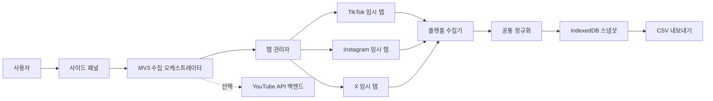

# 확장프로그램 로컬 수집 설계

- 상태: 구현 승인 전 설계안
- 기준일: 2026-07-12
- 대상: Chrome Manifest V3
- 첫 사용자: 동일 Chrome 프로필에 로그인된 본인 계정 1명

## 1. 제품 결정

Creator Data Bridge의 첫 번째 실사용 버전은 **로그인된 Chrome 세션을 이용한 로컬 수집기**로 만든다.

- TikTok, Instagram, X는 사용자가 각 서비스에 로그인해 있으면 확장프로그램이 필요한 탭을 열고 화면에 표시된 데이터를 읽는다.
- 사용자가 플랫폼 탭을 미리 열어둘 필요는 없다.
- 이미 정확한 수집 화면이 열려 있으면 읽기 전용으로 재사용하고, 이동이 필요하면 별도의 임시 탭을 만든다.
- 임시 탭은 탭 표시줄에 나타날 수 있지만 기본적으로 비활성 상태로 열고, 수집이 끝나면 확장프로그램이 만든 탭만 닫는다.
- YouTube는 이미 구현된 공식 API 경로를 유지하며 브라우저 수집 MVP에서는 제외한다.
- 수집 결과는 기본적으로 기기 안에만 저장하고 CSV로 내보낸다. AI나 외부 서버 전송은 별도 동의가 있어야 한다.

이 결정은 2026-07-12 실계정 검증에서 TikTok Studio, Instagram Reel, X 프로필의 콘텐츠 단위 지표를 읽고 20행 CSV를 생성한 결과에 기반한다.

## 2. 목표와 비목표

### MVP 목표

- 사이드 패널에서 `전체 채널 수집` 한 번으로 TikTok, Instagram, X를 순차 수집한다.
- 로그인 여부와 계정 핸들을 수집 전에 확인한다.
- 콘텐츠 URL, 제목, 게시 시각, 길이, 조회, 좋아요, 댓글 등 화면에서 확인 가능한 값을 추출한다.
- 숫자 0과 화면에서 제공되지 않은 값을 구분한다.
- 한 플랫폼이 실패해도 나머지 결과를 보존한다.
- 수집 결과를 미리 보고 UTF-8 BOM CSV로 저장한다.
- 반복 수집 결과를 로컬에 누적해 이후 인기도 추이를 계산할 수 있게 한다.

### MVP 비목표

- 비밀번호, 쿠키, 세션 토큰 직접 읽기
- DM, 댓글 본문, 팔로워 목록 수집
- 좋아요, 팔로우, 댓글 작성 등 플랫폼에 대한 쓰기 작업
- CAPTCHA 우회
- 수익, 광고 계정, 결제 정보 수집
- 수천 개 게시물의 무제한 일괄 수집
- 백그라운드 예약 수집과 클라우드 동기화

## 3. 지원 범위

| 플랫폼 | 주 수집 화면 | MVP 지표 | 현재 제한 |
| --- | --- | --- | --- |
| TikTok | `/tiktokstudio/content`와 프로필 | 프로필 통계, 영상 ID/URL, 제목, 게시 시각, 길이, 조회, 좋아요, 댓글, 공개 범위 | Studio UI와 셀렉터 변경 가능성 |
| Instagram | 프로필과 개별 Reel | 프로필 통계, Reel ID/URL, 캡션, 상대 게시 시각, 좋아요, 댓글 | 현재 웹 화면에서 Reel 조회수 미노출 |
| X | 프로필 타임라인 | 프로필 통계, 게시물 ID/URL, 본문, 게시 시각, 길이, 조회, 좋아요, 답글, 재게시 | 오래된 게시물 로딩과 가상 스크롤 |
| YouTube | 공식 Data/Analytics API | 기존 채널·영상 분석 | 로컬 수집 오케스트레이터와 별도 경로 |

기본 수집 한도는 플랫폼당 최신 100개 또는 10분 중 먼저 도달하는 값으로 한다. 한도에 도달하면 성공으로 위장하지 않고 `partial` coverage와 중단 이유를 CSV 및 화면에 표시한다. 전체 이력 수집은 체크포인트 재개가 구현된 뒤 추가한다.

## 4. 사용자 흐름

### 4.1 최초 설정

1. 사용자가 확장프로그램을 설치한다.
2. 사이드 패널에서 TikTok, Instagram, X를 각각 활성화한다.
3. 플랫폼을 활성화하는 순간 해당 도메인의 선택적 권한을 요청한다.
4. 사용자가 프로필 URL 또는 핸들을 입력하거나, 열려 있는 로그인 탭에서 자동 감지한다.
5. 확장프로그램은 비밀번호를 받지 않고 `로그인 확인`만 수행한다.

### 4.2 원클릭 수집

1. 사용자가 `전체 채널 수집`을 누른다.
2. 사전 점검에서 권한, 네트워크, 로그인, 계정 일치 여부를 확인한다.
3. TikTok → X → Instagram 순으로 한 플랫폼씩 수집한다.
4. 사이드 패널에 현재 단계와 발견한 콘텐츠 수를 표시한다.
5. 각 플랫폼 결과를 즉시 체크포인트에 저장한다.
6. 완료 후 요약, 누락 지표, 실패 플랫폼을 표시한다.
7. 사용자가 `CSV 저장`을 누르면 최신 스냅샷 또는 전체 이력을 선택해 내려받는다.

### 4.3 진행 상태 문구

화면은 기술 용어 대신 다음 상태를 사용한다.

| 내부 상태 | 사용자 표시 |
| --- | --- |
| `preflight` | 로그인과 권한 확인 중 |
| `opening_tab` | 수집 화면 여는 중 |
| `waiting_for_page` | 페이지 준비 기다리는 중 |
| `collecting_profile` | 계정 정보 읽는 중 |
| `collecting_content` | 게시물 수집 중 · 12개 발견 |
| `normalizing` | 데이터 정리 중 |
| `completed` | 수집 완료 |
| `partially_completed` | 일부 데이터만 수집됨 |
| `failed` | 수집하지 못함 |
| `cancelled` | 사용자가 중단함 |

## 5. 시스템 구조



### 5.1 구성 요소

| 구성 요소 | 책임 |
| --- | --- |
| 사이드 패널 | 플랫폼 활성화, 수집 시작/취소, 진행 상태, 결과 요약 |
| 서비스 워커 | 실행 생성, 플랫폼 작업 순서, 체크포인트, 오류 집계, 다운로드 조정 |
| 탭 관리자 | 기존 탭 탐색, 임시 탭 생성, 준비 상태 확인, 원상복구와 정리 |
| 페이지 수집기 | 현재 화면의 DOM을 읽고 플랫폼 원본 레코드 반환 |
| 정규화 계층 | 숫자·날짜·URL·누락 상태를 공통 계약으로 변환 |
| IndexedDB 저장소 | 실행, 콘텐츠, 시점별 지표, selector 진단을 로컬 보존 |
| CSV exporter | 최신/이력 모드, UTF-8 BOM, 안정적인 열 순서와 escaping |

### 5.2 권장 디렉터리

```text
apps/extension/src/
  background/
    orchestrator.ts
    tab-manager.ts
    checkpoint-store.ts
    messages.ts
  collectors/
    core/
      collector.ts
      numbers.ts
      dates.ts
      coverage.ts
    tiktok/
      detector.ts
      collector.ts
      selectors.ts
    instagram/
      detector.ts
      collector.ts
      selectors.ts
    x/
      detector.ts
      collector.ts
      selectors.ts
  storage/
    database.ts
    repositories.ts
  export/
    csv.ts
  sidepanel/
  dashboard/
packages/contracts/src/
  browser-collection.ts
```

DOM 접근 코드는 확장프로그램 안에 두고, 숫자·날짜 파싱과 정규화는 순수 함수로 분리한다. 실제 계정에서 얻은 최소 DOM fixture는 개인정보를 제거한 뒤 테스트 전용으로 저장한다.

## 6. 탭 관리 정책

### 6.1 탭 선택

- 정확한 수집 URL이 이미 열려 있으면 해당 탭을 읽기 전용으로 사용할 수 있다.
- 열린 탭을 다른 URL로 이동해야 한다면 재사용하지 않고 임시 탭을 만든다.
- 임시 탭은 `active: false`로 만들고, 로딩되지 않을 때만 사용자에게 알린 뒤 잠깐 활성화한다.
- 숨겨진 원격 페이지는 만들 수 없으므로 탭 표시줄에 임시 탭이 보일 수 있음을 최초 실행에서 설명한다.

### 6.2 소유권 기록

각 작업은 다음 탭 정보를 체크포인트에 저장한다.

```ts
interface ManagedTab {
  tabId: number;
  platform: "instagram" | "tiktok" | "x";
  ownership: "user" | "extension";
  originalUrl: string | null;
  originalActive: boolean;
  createdAt: string;
}
```

- 확장프로그램이 만든 탭만 자동으로 닫는다.
- 사용자 탭은 닫지 않고, 읽기 전용으로 사용했으면 URL도 바꾸지 않는다.
- 브라우저나 확장프로그램이 중단되면 다음 시작에서 고아 임시 탭을 식별해 사용자 확인 후 정리한다.

## 7. Chrome 권한

### 필수 권한

- `sidePanel`: 주 UI
- `storage`: 설정과 실행 체크포인트
- `scripting`: 사용자 동작으로 시작한 페이지 수집기 주입
- `alarms`: 중단된 실행과 타임아웃 감시

탭 생성·정리에는 `chrome.tabs` API를 사용하지만 manifest의 `tabs` 권한은 요청하지 않는다. 선택적으로 허용된 플랫폼 host permission으로 일치 탭 URL을 확인한다. CSV는 사이드 패널에서 Blob URL과 `<a download>`로 저장하므로 `downloads` 권한도 요청하지 않는다.

### 선택적 호스트 권한

```text
https://www.tiktok.com/*
https://www.instagram.com/*
https://x.com/*
```

플랫폼 활성화 시 해당 도메인만 점진적으로 요청한다. `<all_urls>`, `cookies`, `webRequest` 권한은 사용하지 않는다. 로그인 세션은 Chrome이 페이지를 불러올 때 정상적으로 적용하며 확장프로그램은 쿠키 값을 직접 읽지 않는다.

## 8. 수집기 계약

```ts
interface BrowserCollector<TProfile, TContent> {
  readonly platform: "instagram" | "tiktok" | "x";
  detect(context: CollectorContext): Promise<DetectionResult>;
  collectProfile(context: CollectorContext): Promise<TProfile>;
  collectContentPage(context: CollectorContext): Promise<ContentPage<TContent>>;
  normalize(input: BrowserPayload<TProfile, TContent>): CollectionSnapshot;
}

interface DetectionResult {
  loggedIn: boolean;
  accountMatched: boolean;
  surfaceVersion: string;
  reason?: string;
}

interface ContentPage<T> {
  items: T[];
  cursor: string | null;
  exhausted: boolean;
  evidence: CollectorEvidence;
}
```

수집기는 다음 규칙을 지킨다.

- DOM 읽기만 수행하고 클릭은 상세 화면 이동이나 다음 페이지 로딩에 필요한 경우로 제한한다.
- 좋아요, 댓글 작성, 팔로우 등 외부 쓰기 동작은 코드 경로 자체를 두지 않는다.
- `0`, `null`, `unsupported`, `unavailable`을 구분한다.
- 원본 전체 HTML은 저장하지 않는다.
- 셀렉터 세트 버전과 수집 화면 URL을 각 실행에 기록한다.

## 9. 플랫폼별 전략

### 9.1 TikTok

1. TikTok Studio 콘텐츠 화면을 연다.
2. 계정 핸들과 로그인 상태를 확인한다.
3. 표 또는 카드의 영상 ID, 제목, 게시 시각, 길이, 공개 범위와 지표를 읽는다.
4. 다음 페이지 또는 가상 스크롤을 진행하고 ID 기준으로 중복 제거한다.
5. 프로필 화면에서 팔로워, 팔로잉, 전체 좋아요, 게시물 수를 보완한다.

완료 조건은 콘텐츠 수가 연속 두 번 증가하지 않거나 다음 페이지가 없을 때다.

### 9.2 X

1. 설정한 프로필 URL을 연다.
2. 프로필 요약과 게시물 수를 읽는다.
3. 타임라인의 `article` 단위로 게시물 URL, 본문, 시각, 미디어 길이와 반응 수를 읽는다.
4. 아래로 스크롤하며 게시물 ID 기준으로 병합한다.
5. 연속 세 번 스크롤해 새 ID가 없으면 종료한다.

답글, 재게시, 좋아요, 조회수는 접근성 이름에 포함된 숫자를 우선 사용한다.

### 9.3 Instagram

1. 프로필에서 게시물 수, 팔로워, 팔로잉과 Reel URL을 읽는다.
2. 각 Reel을 임시 상세 탭에서 순차적으로 연다.
3. 캡션, 상대 게시 시각, 좋아요, 댓글을 읽는다.
4. 댓글 버튼이 `댓글 N`이면 N, 숫자 없는 `댓글`이면 0으로 정규화한다.
5. 현재 surface에서 조회수가 없으면 빈 값과 `unavailable` coverage를 저장한다.

Instagram은 로딩 지연이 확인됐으므로 준비 신호가 없으면 1초, 2초 간격으로 최대 두 번 재확인하고 그래도 실패하면 해당 Reel만 부분 실패로 남긴다.

## 10. 데이터 계약

CSV 한 행은 `channel_summary` 또는 `content` 레코드다. 현재 검증 CSV를 기반으로 다음 열을 v1 계약으로 고정한다.

```text
schema_version
run_id
snapshot_at
platform
account_name
account_handle
record_type
content_id
content_url
content_type
title
published_at
duration_seconds
views
views_coverage
likes
likes_coverage
comments
comments_coverage
shares
shares_coverage
saves
saves_coverage
followers
following
total_posts
source_surface
selector_version
notes
```

### 값 규칙

- 화면이 숫자 0을 표시하거나 플랫폼 UI 규칙상 숫자 없는 버튼이 0을 뜻하면 `0`을 기록한다.
- 화면에서 지표를 제공하지 않으면 값은 빈 칸, coverage는 `unsupported` 또는 `unavailable`로 기록한다.
- 로딩 실패로 읽지 못했으면 값은 빈 칸, coverage는 `partial`로 기록한다.
- 축약 숫자 `1.2만`, `2.2천`, `1.5K`, `3M`은 원문과 정규화 값을 함께 검증한다.
- 상대 시간은 원문을 `notes`에 보존하고 확정 가능한 경우에만 ISO 8601로 변환한다.

## 11. 스냅샷과 인기도 추이

CSV를 한 번 만들고 덮어쓰면 추이를 계산할 수 없다. 각 수집 실행은 새 `run_id`와 `snapshot_at`을 가지며 IndexedDB에 append-only로 저장한다.

초기 권장 비교 시점은 다음과 같다.

- 게시 후 1시간
- 게시 후 6시간
- 게시 후 24시간
- 게시 후 72시간
- 이후 주간

MVP는 사용자가 직접 수집하지만, 같은 `platform + content_id`의 이전 값이 있으면 다음 파생값을 화면과 이력 CSV에 제공한다.

- `views_delta`
- `likes_delta`
- `comments_delta`
- `views_per_hour`
- `likes_per_100_known_views` (조회수가 있는 경우만)

서로 다른 플랫폼의 조회, 재생, 노출은 임의로 하나의 점수로 합산하지 않는다. 플랫폼 내부 순위와 콘텐츠별 원본 지표를 우선 표시한다.

## 12. 중단과 오류 처리

### 실행 상태

```text
idle
  -> preflight
  -> running(platform checkpoint 반복)
  -> completed | partially_completed | failed | cancelled
```

### 오류 코드

| 코드 | 의미 | 사용자 조치 |
| --- | --- | --- |
| `PERMISSION_REQUIRED` | 도메인 권한 없음 | 해당 플랫폼 권한 허용 |
| `LOGIN_REQUIRED` | 로그인 화면 또는 비로그인 상태 | 임시 탭에서 로그인 후 재시도 |
| `ACCOUNT_MISMATCH` | 설정 핸들과 로그인 계정 불일치 | 계정 확인 |
| `SURFACE_NOT_READY` | 페이지가 제한 시간 안에 준비되지 않음 | 해당 플랫폼만 재시도 |
| `SELECTOR_MISMATCH` | 예상 DOM 구조를 찾지 못함 | 진단 정보와 확장 업데이트 확인 |
| `COLLECTION_LIMIT_REACHED` | 개수 또는 시간 상한 도달 | 부분 결과 저장, 이어받기 예약 |
| `TAB_INTERRUPTED` | 사용자가 탭을 닫거나 이동함 | 전용 임시 탭으로 재시도 |
| `EXPORT_FAILED` | CSV 생성 또는 다운로드 실패 | 로컬 결과에서 다시 내보내기 |

실행은 플랫폼별로 독립 커밋한다. Instagram 실패가 TikTok과 X 결과를 제거해서는 안 된다.

## 13. MV3 생명주기 대응

- 서비스 워커 메모리를 실행의 단일 진실 원천으로 사용하지 않는다.
- 실행 상태와 현재 플랫폼, 탭 소유권, 발견 ID, 다음 cursor를 `chrome.storage.session`에 저장한다.
- 수집 결과는 행 단위로 IndexedDB에 기록한다.
- 각 수집 단계는 재실행 가능한 작은 명령으로 만든다.
- `chrome.alarms`로 정지된 실행을 감지하고 사용자에게 `이어하기` 또는 `정리`를 제공한다.
- 같은 `run_id + platform + content_id + snapshot_at`은 중복 삽입하지 않는다.

## 14. 개인정보와 신뢰

- 기본 모드는 완전 로컬이다.
- 확장프로그램은 로그인 쿠키와 토큰을 읽거나 저장하지 않는다.
- DM, 댓글 작성자와 댓글 본문, 팔로워 목록은 수집하지 않는다.
- 진단 로그에는 URL 전체 대신 플랫폼, 오류 코드, selector 버전만 남긴다. 콘텐츠 URL은 사용자가 결과에 포함하기로 선택한 경우에만 export한다.
- AI 전송 기능을 추가할 때는 대상, 파일, 포함 필드를 전송 직전에 다시 보여준다.
- 사이드 패널에 `외부 전송 없음`과 마지막 수집 시각을 항상 표시한다.

## 15. UI 정보 구조

### 사이드 패널

- 상단: 계정 이름, 마지막 수집 시각
- 플랫폼 목록: 로그인/권한/수집 가능/오류 상태
- 기본 작업: `전체 채널 수집`
- 진행 영역: 현재 플랫폼, 단계, 발견 콘텐츠 수, 취소 버튼
- 완료 영역: 수집 행 수, 누락 지표 수, CSV 저장 버튼

### 전체 대시보드

- `최근 결과`: 플랫폼별 성공/부분 실패와 핵심 수치
- `콘텐츠`: 같은 원본 영상 묶기와 플랫폼별 지표 비교
- `추이`: 스냅샷별 증가량
- `수집 기록`: 실행별 시간, 행 수, 경고, 재시도
- `설정`: 플랫폼 핸들, 권한, 수집 한도, 데이터 삭제

## 16. 테스트 전략

### 단위 테스트

- 한국어·영어 축약 숫자 파싱
- 숫자 없는 Instagram 댓글 버튼을 0으로 변환
- 날짜와 상대 시간 처리
- coverage와 빈 값 구분
- CSV quoting, BOM, 열 순서

### fixture 계약 테스트

- 플랫폼별 개인정보 제거 DOM fixture를 순수 parser에 입력한다.
- selector 버전마다 정상 fixture와 필수 요소가 빠진 fixture를 둔다.
- 기대 레코드와 warning을 snapshot test로 고정한다.

### 확장 통합 테스트

- 기존 탭 재사용과 임시 탭 생성
- 사용자 탭을 닫지 않는지 확인
- 플랫폼 하나 실패 후 부분 완료
- 취소 후 체크포인트와 임시 탭 정리
- 서비스 워커 재시작 후 이어하기
- 최신 CSV와 이력 CSV 재가져오기

### 실계정 smoke test

배포 전 loorbit 계정으로 다음 기준을 확인한다.

- TikTok, Instagram, X에서 각각 최소 4개 콘텐츠 수집
- 수동 검증 CSV와 콘텐츠 ID 일치
- Instagram 좋아요 `5, 1, 7, 1` 같은 변경 가능한 값은 수집 시각과 함께 기록
- Instagram 조회수는 0이 아니라 빈 값과 `unavailable`
- 임시 탭 정리 후 기존 사용자 탭 위치 유지

## 17. 구현 단계

| 단계 | 범위 | 예상 |
| --- | --- | --- |
| 1 | 브라우저 수집 계약, IndexedDB, CSV exporter | 1~2일 |
| 2 | 탭 관리자, 권한 요청, 실행 체크포인트 | 1~2일 |
| 3 | TikTok collector와 fixture | 1~2일 |
| 4 | X collector와 가상 스크롤 | 1~2일 |
| 5 | Instagram collector와 상세 Reel 재시도 | 2일 |
| 6 | 사이드 패널 진행 UX와 결과 미리보기 | 1~2일 |
| 7 | 통합 테스트, 실계정 smoke test, selector 진단 | 2일 |

MVP 예상은 집중 개발 9~14일이다. 첫 구현은 TikTok 하나를 수집 시작부터 CSV까지 수직으로 완성한 뒤 X와 Instagram을 붙인다.

## 18. MVP 완료 기준

- 사용자가 플랫폼 탭을 미리 열지 않아도 세 플랫폼 수집을 시작할 수 있다.
- 로그인된 loorbit 계정의 TikTok, Instagram, X 콘텐츠가 수동 검증 결과와 일치한다.
- 좋아요, 댓글, 조회수의 0과 미제공 상태가 구분된다.
- 실패 플랫폼만 다시 실행할 수 있다.
- 사용자가 취소하거나 브라우저를 재시작해도 기존 결과와 사용자 탭을 손상하지 않는다.
- CSV가 Excel과 PowerShell `Import-Csv`에서 정상적으로 열린다.
- 원본 HTML, 쿠키, 토큰, 댓글 본문이 저장되거나 export되지 않는다.
- selector가 바뀌면 잘못된 0을 생성하지 않고 `SELECTOR_MISMATCH`로 중단한다.

## 19. 후속 후보

- Instagram Professional Dashboard에서 Reel 조회수 수집
- 수집 이어받기를 이용한 전체 이력 모드
- 게시 후 1/6/24/72시간 알림 기반 수동 스냅샷
- 동일 원본 영상 자동 묶기 후보와 사용자 확인
- AI용 `summary.md + content.csv + data_dictionary.md` 패키지
- 플랫폼 selector fixture 갱신 절차를 `skills/social-browser-collector/` 워크플로우로 분리

자동 업로드는 DOM 수집과 다른 보안·API 경계를 사용한다. 게시 기능의 사용자 흐름, 미디어 저장소, 플랫폼 심사와 안전 기준은 [교차 플랫폼 자동 업로드 설계](AUTOMATED_PUBLISHING_SPEC.md)를 따른다.

CSV MVP의 화면, 메시지, IndexedDB, PR 순서와 출시 게이트는 [CSV 추출 확장프로그램 MVP 실행 계획](CSV_EXTENSION_MVP_PLAN.md)을 구현 기준으로 사용한다.
